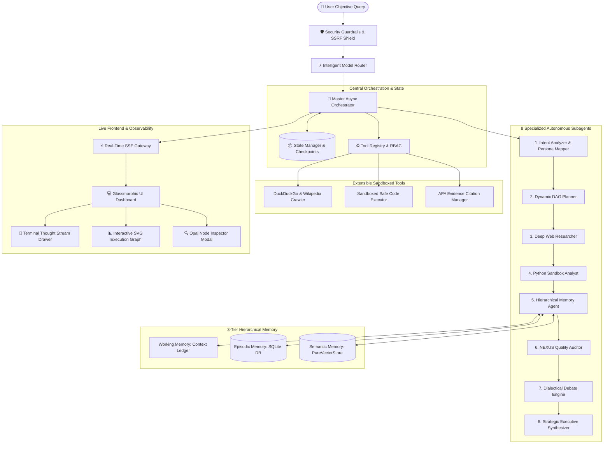

# NeuroWeave: Autonomous Multi-Agent Intelligence & Research Engine

<div align="center">

[](https://python.org)
[](https://fastapi.tiangolo.com)
[]()
[](https://github.com)
[](LICENSE)

**An enterprise-grade, autonomous multi-agent intelligence platform that formulates dynamic task DAGs, executes deep web intelligence & sandboxed Python mathematics, audits facts via adversarial debate, and synthesizes publication-grade executive briefs with interactive charts and APA citations.**

</div>

---

**NeuroWeave** is a self-contained autonomous multi-agent research and reasoning engine built around deterministic planning, evidence retrieval, analysis, verification, memory and synthesis.

It operates in **100% Pure Zero-API Deterministic Mode**: fully self-contained execution using dynamic DAG generation, live DuckDuckGo/Wikipedia evidence retrieval, safe Python sandboxed mathematics, epistemic uncertainty bounding, and multi-round dialectic contradiction auditing with zero external LLM dependencies, zero cloud API keys, and zero local model runtimes.

---

## 🏗️ 8-Stage Autonomous Multi-Agent Architecture


```mermaid
graph TD
    User([🎯 User Objective Query]) --> Shield[🛡️ Security Guardrails & SSRF Shield]
    Shield --> Router[⚡ Intelligent Model Router]
    
    subgraph "Central Orchestration & State"
        Orchestrator[🧠 Master Async Orchestrator]
        StateMgr[(📦 State Manager & Checkpoints)]
        ToolRegistry[⚙️ Tool Registry & RBAC]
    end
    
    Router --> Orchestrator
    Orchestrator <--> StateMgr
    Orchestrator --> ToolRegistry
    
    subgraph "8 Specialized Autonomous Subagents"
        Intent[1. Intent Analyzer & Persona Mapper]
        Planner[2. Dynamic DAG Planner]
        Researcher[3. Deep Web Researcher]
        Analyzer[4. Python Sandbox Analyst]
        MemoryAgent[5. Hierarchical Memory Agent]
        Critic[6. NEXUS Quality Auditor]
        Debate[7. Dialectical Debate Engine]
        Synthesizer[8. Strategic Executive Synthesizer]
    end
    
    Orchestrator --> Intent
    Intent --> Planner
    Planner --> Researcher
    Researcher --> Analyzer
    Analyzer --> MemoryAgent
    MemoryAgent --> Critic
    Critic --> Debate
    Debate --> Synthesizer
    
    subgraph "3-Tier Hierarchical Memory"
        WM[Working Memory: Context Ledger]
        EM[(Episodic Memory: SQLite DB)]
        SM[(Semantic Memory: PureVectorStore)]
    end
    
    MemoryAgent <--> WM
    MemoryAgent <--> EM
    MemoryAgent <--> SM

    subgraph "Extensible Sandboxed Tools"
        WebSearch[DuckDuckGo & Wikipedia Crawler]
        Sandbox[Sandboxed Safe Code Executor]
        CitationMgr[APA Evidence Citation Manager]
    end
    
    ToolRegistry --> WebSearch
    ToolRegistry --> Sandbox
    ToolRegistry --> CitationMgr

    subgraph "Live Frontend & Observability"
        SSE[⚡ Real-Time SSE Gateway]
        UI[💻 Glassmorphic UI Dashboard]
        Logs[📜 Terminal Thought Stream Drawer]
        DAG[📊 Interactive SVG Execution Graph]
        Inspector[🔍 Opal Node Inspector Modal]
    end
    
    Orchestrator --> SSE
    SSE --> UI
    UI --> Logs
    UI --> DAG
    UI --> Inspector
```

---

## 🤖 Detailed Subagent Breakdown

| Agent | Responsibility | Core Technology / Mechanics |
| :--- | :--- | :--- |
| **1. Intent Analyzer** | Classifies query intent, category, and maps objective to **261 Agency Specialist Personas** across 6 divisions. | Regex + Keyword intent parsing, Persona Registry (`core/persona_manager.py`) |
| **2. Dynamic Planner** | Decomposes objectives into a multi-wave Directed Acyclic Graph (DAG) with dependency resolution. | Topological sort DAG engine (`core/dag_engine.py`) |
| **3. Web Researcher** | Executes multi-angle web searches, extracts Wikipedia paragraphs, and captures verifiable sources. | DuckDuckGo Instant Answers + Wikipedia API (`tools/web_search.py`) |
| **4. Sandbox Analyst** | Writes and executes safe Python scripts in a sandboxed subprocess to compute exact quantitative metrics. | Restricted AST subprocess executor (`tools/code_executor.py`) |
| **5. Memory Agent** | Synchronizes intermediate findings across working context, SQLite episodic records, and vector embeddings. | 3-Tier memory manager (`memory/memory_manager.py`) |
| **6. NEXUS Critic** | Audits findings for factual consistency, mathematical validity, and hallucinations. Calculates confidence score (0.00–1.00). | Adversarial fact-checker & rubric scorer (`agents/critic.py`) |
| **7. Debate Engine** | Conducts 2-round dialectical debate between Critic objections and Researcher evidence to form verified consensus. | Adversarial consensus engine (`agents/debate_engine.py`) |
| **8. Synthesizer** | Compiles publication-grade strategic brief with executive summary, comparison matrices, Chart.js graphs, and APA citations. | Adaptive synthesizer (`core/superpower_synthesizer.py`) |

---

## 🏢 261 Agency Specialist Personas & 6 Divisions

NeuroWeave features 261 dynamic agent personas divided across 6 functional divisions. The system auto-assigns the ideal specialist or allows manual filtering:

```
├── 🚀 Marketing Division (Growth Hacker, Viral Strategist, SEO Architect, Brand Strategist...)
├── 💰 Finance Division (DCF Valuation Specialist, VC Analyst, Cap Table Architect, M&A Auditor...)
├── 📦 Product Division (Technical Product Manager, UI/UX Lead, Feature Prioritization Lead...)
├── 🏗️ Architecture Division (Distributed Systems Architect, Database Optimizer, Cloud FinOps...)
├── 🛡️ Security Division (Penetration Tester, Zero-Trust Architect, Cloud Compliance Auditor...)
└── 🔬 Research Division (Deep Learning Scientist, Benchmark Specialist, Literature Analyst...)
```

---

## 💻 Frontend Dashboard & Interactive Features

The user interface (`ui/index.html`, `ui/app.js`, `ui/styles.css`) is built with modern, ultra-responsive glassmorphism:

1. **Live Thought Stream Logs Drawer**:
   - Slides in from the right with microsecond-timestamped logs for every agent state transition, tool call, memory sync, and debate reconciliation.
2. **Interactive SVG Execution DAG**:
   - Live visual task cards with glowing status borders (`Queued`, `Running`, `Completed`, `Failed`) and flowing energy pulse connection tracks.
3. **Opal Glassmorphic Node Inspector Modal**:
   - Click any DAG node card to inspect Task ID, Execution Latency, Dependencies, Retries, executed Sandboxed Python Code, Quantitative Metrics, and Output Computations with 1-click clipboard copy.
4. **Telemetry Waterfall Timeline**:
   - Gantt chart visualizer profiling per-agent execution duration and resource latencies in milliseconds.
5. **Dynamic Data Visualizer (Chart.js)**:
   - Automatically renders responsive dark-theme Bar and Pie charts from embedded markdown code blocks.
6. **Knowledge Vault & Live URL Ingestion**:
   - Drag & drop local documents (`.txt`, `.md`, `.json`) or paste live web URLs to instantly scrape and index them into semantic vector memory.
7. **1-Click Session History & State Reconstruction**:
   - Click any past session from the sidebar to instantly restore the Strategic Report, DAG graph, traces timeline, and execution logs from the SQLite database.
8. **Export Suite**:
   - 1-click Markdown Copy, `.md` file download, and native `html2pdf.js` PDF Export.

---

## 📂 Project Directory Structure

```
NeuroWeave/
├── main.py                     # Primary FastAPI application entrypoint & server launcher
├── api/
│   └── routes.py               # REST API endpoints & Server-Sent Events (SSE) stream handler
├── core/
│   ├── dag_engine.py           # Topological DAG task graph engine & dependency resolution
│   ├── model_router.py         # Dynamic model selector (Gemini / OpenAI / Groq / Local)
│   ├── persona_manager.py      # 261 Agency specialist personas registry & division router
│   ├── state_manager.py        # Centralized thread-safe execution state manager & rollback checkpoints
│   ├── superpower_synthesizer.py# Domain-aware adaptive report synthesizer with APA bibliography
│   ├── structured_output.py    # Pydantic schema validation & self-healing JSON parsing
│   └── tool_registry.py        # Decorator-driven sandboxed tool registry & RBAC enforcement
├── agents/
│   ├── orchestrator.py         # Master workflow orchestrator & pipeline lifecycle manager
│   ├── intent_analyzer.py      # Intent classifier & persona mapping agent
│   ├── planner.py              # Dynamic DAG formulation & goal expansion agent
│   ├── researcher.py           # Deep web scraping & Wikipedia fact extraction agent
│   ├── analyzer.py             # Python sandbox calculation & data analytics agent
│   ├── critic.py               # NEXUS quality assurance & adversarial fact-checking agent
│   ├── debate_engine.py        # 2-round dialectical debate consensus engine
│   ├── memory_agent.py         # 3-tier hierarchical memory sync agent
│   └── synthesizer.py          # Executive briefing compiler agent
├── memory/
│   ├── memory_manager.py       # Hierarchical memory manager (Working, Episodic, Semantic)
│   └── vector_store.py         # Pure-Python TF-IDF semantic vector store
├── storage/
│   ├── database.py             # Asynchronous aiosqlite database connection manager
│   ├── repository.py           # CRUD repository for sessions, reports, tasks, traces, & logs
│   └── neuroweave.db           # SQLite database storing session archives & telemetry
├── tools/
│   ├── web_search.py           # DuckDuckGo search + Wikipedia paragraph crawler
│   └── code_executor.py        # Safe restricted Python execution sandbox
├── utils/
│   ├── citation_manager.py     # APA evidence tracker & bibliography generator
│   └── ml_utils.py             # Local NLP sentiment & keyword analysis engine
├── security/
│   ├── guardrails.py           # Prompt injection shields, SSRF filters, & AST checks
│   └── permissions.py          # Role-Based Agent Control (RBAC) permission validator
├── observability/
│   ├── logger.py               # Structured asynchronous JSON logger
│   ├── metrics.py              # Token counter & cost estimation tracker
│   └── traces.py               # Distributed latency waterfall tracer
├── ui/
│   ├── index.html              # Premium glassmorphic interface layout & modal components
│   ├── app.js                  # Frontend SSE stream handler, DAG plotter, & report renderer
│   └── styles.css              # Dark-mode styling, animations, and glowing cyber accents
└── requirements.txt            # Python dependencies (zero native C++ build requirements)
```

---

## 🚀 Quickstart & Installation

NeuroWeave is designed for zero-friction setup on **Windows, macOS, and Linux**.

### 1. Prerequisites
- Python 3.10 or higher (`python --version`)

### 2. Clone & Install Dependencies
```bash
git clone https://github.com/Akshitkumar23/NeuroWeave.git
cd NeuroWeave

# Install required Python packages
pip install -r requirements.txt
```

### 3. Configure Credentials (Optional)
NeuroWeave works **100% locally out-of-the-box** without any API keys. If you wish to enable live cloud LLMs, create a `.env` file:

```ini
# .env Configuration (Optional)
GEMINI_API_KEY="your-google-api-key"
OPENAI_API_KEY="your-openai-api-key"
GROQ_API_KEY="your-groq-api-key"

PORT=8000
HOST="127.0.0.1"
```

### 4. Launch the Engine
```bash
python main.py
```
Open your browser and navigate to: **`http://127.0.0.1:8000`**

---

## 📡 REST & SSE API Reference

| Endpoint | Method | Description |
| :--- | :---: | :--- |
| `/api/analyze` | `POST` | Initiates an autonomous research session. Returns `{ "success": true, "session_id": "..." }`. |
| `/api/stream/{session_id}` | `GET` | Real-time Server-Sent Events (SSE) stream yielding live JSON state checkpoints and thought logs. |
| `/api/report/{session_id}` | `GET` | Retrieves synthesized strategic report, tasks DAG, telemetry traces, and execution logs from SQLite. |
| `/api/sessions` | `GET` | Lists all historical research sessions stored in the local SQLite database. |
| `/api/sessions/{session_id}`| `DELETE`| Deletes a session and its associated logs, traces, and metrics from SQLite. |
| `/api/upload` | `POST` | Uploads a `.txt`, `.md`, or `.json` file into the semantic vector store. |
| `/api/ingest-url` | `POST` | Scrapes external web URLs and indexes clean text chunks into memory. |
| `/api/key-status` | `GET` | Returns active LLM providers and operational modes (`live` or `local synthesizer`). |
| `/api/save-key` | `POST` | Persists user-supplied API keys directly to `.env` and updates active process environment. |

---

## 🧪 Automated Verification & Testing

NeuroWeave includes automated headless browser integration tests and pipeline verification suites:

```bash
# Run Chrome end-to-end automated UI & SSE streaming verification
python scratch/test_chrome_ui.py

# Run comprehensive multi-domain report audit
python scratch/audit_db_reports.py

# Run deep pipeline integration tests
python test_deep_pipeline.py
```

---

## 🛡️ Security & Guardrails

- **AST Safe Execution Sandbox**: Intercepts dangerous Python operations (`os.system`, `subprocess`, `open`, `__import__`) before execution.
- **SSRF Injection Filter**: Restricts web crawling to authorized public protocols and blocks private internal network probes (`localhost`, `127.0.0.1`, `10.0.0.0/8`, `192.168.0.0/16`).
- **Role-Based Agent Control (RBAC)**: Enforces least-privilege tool access (e.g. `Researcher` is strictly prohibited from code execution).

---

## 📄 License

This project is licensed under the MIT License — see the [LICENSE](LICENSE) file for details.
