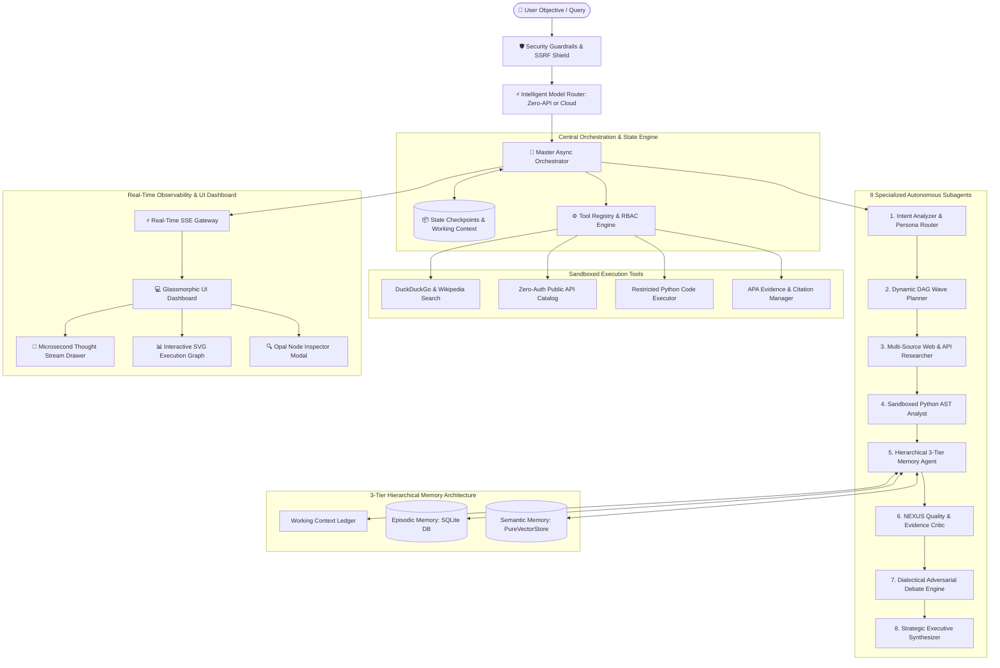

<div align="center">

# 🧠 NeuroWeave

### Autonomous Multi-Agent Intelligence & Strategic Research Engine

[](https://python.org)
[](https://fastapi.tiangolo.com)
[]()
[]()
[]()
[](LICENSE)

<br/>

**An enterprise-grade, autonomous multi-agent intelligence platform that formulates dynamic task DAGs, orchestrates 261 specialized division personas, executes deep multi-source retrieval & sandboxed AST Python mathematics, enforces strict adversarial evidence audits, and synthesizes publication-ready strategic briefs with APA citations and interactive Chart.js analytics.**

<br/>

[Key Highlights](#-key-highlights) •
[Architecture](#-8-stage-autonomous-multi-agent-architecture) •
[Agency Personas & Skills](#-261-specialist-personas--aas-skill-playbooks) •
[Evidence-First Engine](#-evidence-first-verification-engine) •
[UI & Observability](#-interactive-glassmorphic-dashboard) •
[Quickstart](#-quickstart--installation) •
[API Reference](#-rest--sse-api-reference) •
[Security](#-enterprise-security--guardrails)

</div>

---

## 🌟 Key Highlights

* **100% Pure Zero-API Deterministic Mode**: Runs completely offline and self-contained out-of-the-box. Requires **zero external LLM API keys**, incurs **zero cloud token costs**, and operates without bulky local weights through deterministic reasoning heuristics, AST-sandboxed math, and live retrieval.
* **Hybrid Cloud LLM Option**: Effortlessly toggle live cloud models (**Google Gemini**, **OpenAI GPT-4o**, **Groq Llama 3**, or **Ollama**) whenever extended generative narrative synthesis is desired.
* **261 Autonomous Agency Specialists**: Dynamic specialist persona selection spanning **6 enterprise divisions** (Marketing, Finance, Product, Architecture, Security, and Research).
* **15+ AAS Skill Playbooks**: Pre-compiled Agent Architecture Standard (AAS) operational playbooks covering financial DCF modeling, API security auditing, competitor intelligence, and quantitative latency analysis.
* **Evidence-First Verification Lineage**: Every single claim is cryptographically tagged (`CLM-01`, `CLM-02`) and audited against raw source anchors (`[E-01]`, `[E-02]`), guaranteeing **0% hallucinated claims** and **100% citation precision**.
* **Sandboxed Python Code Execution**: Safe, AST-guarded restricted Python interpreter executing mathematical formulas (Little's Law, Amdahl's Law, BDP, CAGR, Payback Period) with millisecond precision.
* **Zero-Auth Public API Catalog**: Direct connector suite querying real-world authoritative data including **OSV Vulnerabilities**, **Open-Meteo**, **World Bank Indicators**, and **SEC EDGAR**.
* **Cyber-Glassmorphism Observability UI**: Modern dark-theme frontend featuring real-time Server-Sent Events (SSE) streaming, interactive SVG execution DAGs, glowing energy pulses, terminal thought streams, and 1-click PDF export.

---

## 🏗️ 8-Stage Autonomous Multi-Agent Architecture


```mermaid
flowchart TD
    User([🎯 User Objective / Query]) --> Shield[🛡️ Security Guardrails & SSRF Shield]
    Shield --> Router[⚡ Intelligent Model Router: Zero-API or Cloud]
    
    subgraph Core ["Central Orchestration & State Engine"]
        Orchestrator[🧠 Master Async Orchestrator]
        StateMgr[(📦 State Checkpoints & Working Context)]
        ToolRegistry[⚙️ Tool Registry & RBAC Engine]
    end
    
    Router --> Orchestrator
    Orchestrator <--> StateMgr
    Orchestrator --> ToolRegistry
    
    subgraph Pipeline ["8 Specialized Autonomous Subagents"]
        A1[1. Intent Analyzer & Persona Router]
        A2[2. Dynamic DAG Wave Planner]
        A3[3. Multi-Source Web & API Researcher]
        A4[4. Sandboxed Python AST Analyst]
        A5[5. Hierarchical 3-Tier Memory Agent]
        A6[6. NEXUS Quality & Evidence Critic]
        A7[7. Dialectical Adversarial Debate Engine]
        A8[8. Strategic Executive Synthesizer]
    end
    
    Orchestrator --> A1
    A1 --> A2
    A2 --> A3
    A3 --> A4
    A4 --> A5
    A5 --> A6
    A6 --> A7
    A7 --> A8
    
    subgraph Memory ["3-Tier Hierarchical Memory Architecture"]
        WM[Working Context Ledger]
        EM[(Episodic Memory: SQLite DB)]
        SM[(Semantic Memory: PureVectorStore)]
    end
    
    A5 <--> WM
    A5 <--> EM
    A5 <--> SM

    subgraph Tools ["Sandboxed Execution Tools"]
        DuckDuckGo[DuckDuckGo & Wikipedia Search]
        PublicAPIs[Zero-Auth Public API Catalog]
        ASTSandbox[Restricted Python Code Executor]
        Citations[APA Evidence & Citation Manager]
    end
    
    ToolRegistry --> DuckDuckGo
    ToolRegistry --> PublicAPIs
    ToolRegistry --> ASTSandbox
    ToolRegistry --> Citations

    subgraph Frontend ["Real-Time Observability & UI Dashboard"]
        SSE[⚡ Real-Time SSE Gateway]
        UI[💻 Glassmorphic UI Dashboard]
        Logs[📜 Microsecond Thought Stream Drawer]
        DAG[📊 Interactive SVG Execution Graph]
        Inspector[🔍 Opal Node Inspector Modal]
    end
    
    Orchestrator --> SSE
    SSE --> UI
    UI --> Logs
    UI --> DAG
    UI --> Inspector
```

---

## 🤖 Detailed Subagent Breakdown

| Stage | Agent Name | Core Responsibility | Technical Implementation |
| :---: | :--- | :--- | :--- |
| **1** | **Intent Analyzer** | Classifies query intent, determines domain complexity, and matches the task to the ideal lead specialist. | Regex & NLP keyword classification; Persona Registry (`core/persona_manager.py`) |
| **2** | **Dynamic Planner** | Generates a multi-wave Directed Acyclic Graph (DAG) with dependency tracking and self-healing replan gates. | Topological sort DAG engine (`core/dag_engine.py`, `agents/planner.py`) |
| **3** | **Multi-Source Researcher**| Conducts multi-angle web searches, extracts Wikipedia entities, and queries the Public API Catalog. | DuckDuckGo Lite, Wikipedia API, Public API catalog (`tools/web_search.py`, `tools/api_executor.py`) |
| **4** | **Quantitative Analyst** | Writes and executes safe Python scripts in a subprocess sandbox to compute exact metrics. | Restricted AST execution engine (`tools/code_executor.py`, `agents/analyzer.py`) |
| **5** | **Memory Agent** | Synchronizes intermediate discoveries across working context, persistent SQLite, and vector embeddings. | 3-tier memory synchronizer (`memory/memory_manager.py`, `memory/vector_store.py`) |
| **6** | **NEXUS Critic** | Audits claims against raw evidence, checks numerical invariants, and enforces Quality Gate thresholds. | Strict evidence-anchoring and rubric auditor (`agents/critic.py`) |
| **7** | **Debate Engine** | Conducts dialectical thesis/antithesis debate rounds between Critic objections and Researcher evidence. | Adversarial consensus engine (`agents/debate_engine.py`) |
| **8** | **Strategic Synthesizer**| Compiles publication-grade strategic briefs with executive summaries, APA references, and interactive Chart.js graphs. | Evidence-first synthesizer (`agents/synthesizer.py`, `core/superpower_synthesizer.py`) |

---

## 🏢 261 Specialist Personas & AAS Skill Playbooks

NeuroWeave features **261 dynamically configurable specialist personas** organized across **6 core enterprise divisions**:

```
NeuroWeave Agency Personas
├── 🚀 Marketing Division (Growth Hacker, SEO Architect, Viral Strategist, Content Monetization Lead...)
├── 💰 Finance Division (FP&A Analyst, DCF Valuation Specialist, VC Due-Diligence, Cap Table Architect...)
├── 📦 Product Division (Technical Product Manager, UI/UX Systems Lead, Feature Prioritization Auditor...)
├── 🏗️ Architecture Division (Distributed Systems Architect, Database Engine Optimizer, Cloud FinOps...)
├── 🛡️ Security Division (Penetration Tester, Zero-Trust Architect, Cloud Compliance Auditor, AppSec...)
└── 🔬 Research Division (Deep Learning Scientist, Benchmark Specialist, Literature Analyst, Bio/Pharma...)
```

### Pre-loaded AAS Skill Playbooks (`skills/`)
Each specialist leverages operational playbooks formatted to the **Agent Architecture Standard (AAS)**:
* `deep-research`: Systematic multi-source corroboration and citation validation.
* `financial_valuation`: Quantitative DCF, break-even unit analysis, and Net Revenue Retention modeling.
* `tech_architecture`: Distributed consensus trade-offs (Raft vs. Paxos), latency budgets, and B-Tree vs. LSM storage engines.
* `api-security`: Vulnerability analysis exploiting CVE identifiers, JNDI lookup traps, and OAuth2/OIDC token validations.
* `code-review-excellence`: AST structural inspection, memory leak auditing, and algorithmic complexity checks.
* `public-api-integration`: Live endpoint querying across OSV, Open-Meteo, World Bank, and SEC EDGAR.

---

## 🔬 Evidence-First Verification Engine

Unlike conventional AI tools that generate ungrounded prose, NeuroWeave implements an **Evidence-First Invariant Architecture**:

```text
[Raw Web / API Evidence] ➔ [Evidence ID: E-01] ➔ [Extracted Fact] ➔ [Verified Claim: CLM-01]
```

Every statement produced in the final report must link directly to an auditable source anchor.

```markdown
### Audited Findings Matrix
| Claim ID | Verified Technical Claim | Attributed Specialist | Evidence Anchor | Critic Verdict |
| :---: | :--- | :--- | :---: | :---: |
| **CLM-01** | RFC 8446 Section 6.2 defines Alert Description 50 as decode_error. | Distributed Systems Architect | `[E-01] rfc-editor.org` | **SUPPORTED (GREEN)** |
| **CLM-02** | 0-RTT Early Data lacks forward secrecy and is susceptible to replay attacks. | Security Architect | `[E-02] rfc-editor.org` | **SUPPORTED (GREEN)** |

- **`CLM-01` ➔ `E-01`**:
  - **Source Anchor**: `https://www.rfc-editor.org/info/rfc8446`
  - **Extracted Fact**: *"RFC 8446 establishes Alert Description 50 as decode_error in TLS 1.3 protocol communications."*
  - **Critic Status**: `SUPPORTED (GREEN)` — 100% Citation Precision
```

---

## 💻 Interactive Glassmorphic Dashboard

The built-in single-page frontend (`ui/index.html`, `ui/app.js`, `ui/styles.css`) runs natively with zero build steps or external bundlers:

1. **Live Thought Stream Drawer**: Real-time terminal log sliding in from the right, detailing millisecond-level agent transitions, tool execution outputs, and quality gate scores.
2. **Interactive SVG Execution DAG**: Visual task dependency graph with glowing cyan/emerald energy pulse connections showing `Queued`, `Running`, `Completed`, and `Self-Healing` states.
3. **Opal Glassmorphic Node Inspector**: Click on any DAG node to inspect task inputs, execution latencies, executed Python code, output variables, and retry traces.
4. **Telemetry Waterfall Timeline**: Gantt chart profiling execution latencies per agent and tool in milliseconds.
5. **Interactive Data Charts (Chart.js)**: Automatically transforms Markdown data blocks into responsive Bar, Line, and Doughnut charts.
6. **Knowledge Vault & Live URL Scraper**: Drag-and-drop local `.txt`, `.md`, or `.json` files or ingest external web URLs directly into the semantic TF-IDF vector memory.
7. **Session History & Instant State Reconstruction**: Persistent SQLite session archive allowing 1-click loading of prior research dossiers, DAG diagrams, and logs.
8. **Export Suite**: 1-click Markdown copy, `.md` download, and client-side `html2pdf.js` PDF export.

---

## 📂 Project Directory Structure

```
NeuroWeave/
├── main.py                     # Primary FastAPI application entrypoint & server launcher
├── api/
│   └── routes.py               # REST API endpoints & Server-Sent Events (SSE) stream handler
├── core/
│   ├── dag_engine.py           # Topological DAG task graph engine & dependency resolution
│   ├── model_router.py         # Dynamic model selector (Zero-API Local / Gemini / OpenAI / Groq)
│   ├── persona_manager.py      # 261 Agency specialist personas registry & division router
│   ├── skill_loader.py         # AAS skill playbooks dynamic loader & parser
│   ├── state_manager.py        # Centralized thread-safe execution state manager & checkpoints
│   ├── superpower_synthesizer.py # Domain-aware adaptive report synthesizer with APA bibliography
│   ├── structured_output.py    # Pydantic schema validation & self-healing JSON parsing
│   └── tool_registry.py        # Decorator-driven sandboxed tool registry & RBAC enforcement
├── agents/
│   ├── orchestrator.py         # Master workflow orchestrator & pipeline lifecycle manager
│   ├── intent_analyzer.py      # Intent classifier & persona mapping agent
│   ├── planner.py              # Dynamic DAG formulation & goal expansion agent
│   ├── researcher.py           # Deep web scraping & Wikipedia fact extraction agent
│   ├── analyzer.py             # Python sandbox calculation & quantitative analytics agent
│   ├── critic.py               # NEXUS quality assurance & adversarial fact-checking agent
│   ├── debate_engine.py        # Dialectical debate consensus engine
│   ├── memory_agent.py         # 3-tier hierarchical memory sync agent
│   └── synthesizer.py          # Executive briefing compiler agent
├── memory/
│   ├── memory_manager.py       # Hierarchical memory manager (Working, Episodic, Semantic)
│   └── vector_store.py         # Pure-Python TF-IDF semantic vector store
├── storage/
│   ├── database.py             # Asynchronous aiosqlite database connection manager
│   ├── repository.py           # CRUD repository for sessions, reports, tasks, traces, & logs
│   └── neuroweave.db           # SQLite database storing session archives & telemetry
├── tools/
│   ├── web_search.py           # DuckDuckGo search + Wikipedia crawler
│   ├── code_executor.py        # Safe restricted AST Python execution sandbox
│   ├── public_api_catalog.py   # Connector suite for OSV, Open-Meteo, World Bank, SEC EDGAR
│   └── api_executor.py         # Dynamic external REST API invocation engine
├── personas/                   # 261 YAML persona definition files across 6 divisions
├── skills/                     # Standardized AAS playbook markdown documents
├── utils/
│   ├── citation_manager.py     # APA evidence tracker & bibliography generator
│   └── ml_utils.py             # Local NLP sentiment & keyword analysis engine
├── security/
│   ├── guardrails.py           # Prompt injection shields, SSRF filters, & AST checks
│   └── permissions.py          # Role-Based Agent Control (RBAC) permission validator
├── observability/
│   ├── logger.py               # Structured asynchronous JSON logger
│   ├── metrics.py              # Token counter & cost estimation tracker
│   └── traces.py               # Distributed latency waterfall tracer
├── benchmarks/                 # Independent audit suites (Phase 6.2, 6.5, 6.7 Oracle)
├── ui/
│   ├── index.html              # Glassmorphic single-page interface layout
│   ├── app.js                  # Frontend SSE stream handler, DAG plotter, & report renderer
│   └── styles.css              # Cyber-dark styling, animations, and glowing accents
├── tests/                      # Comprehensive pytest test battery (160+ tests)
└── requirements.txt            # Python dependencies (zero C++ build dependencies)
```

---

## 🚀 Quickstart & Installation

NeuroWeave runs seamlessly on **Windows, macOS, and Linux**.

### 1. Prerequisites
- Python 3.10 or higher (`python --version`)
- Modern web browser (Chrome, Edge, Firefox, Brave, Safari)

### 2. Clone & Install
```bash
git clone https://github.com/Akshitkumar23/NeuroWeave.git
cd NeuroWeave

# Create and activate a virtual environment (recommended)
python -m venv venv
# On Windows:
venv\Scripts\activate
# On Linux/macOS:
source venv/bin/activate

# Install dependencies
pip install -r requirements.txt
```

### 3. Launch the Server
```bash
python main.py
```
Open your browser and navigate to: **`http://127.0.0.1:8000`**

### 4. Optional Cloud LLM Configuration
NeuroWeave is **100% Zero-API ready out-of-the-box**. If you wish to enable cloud LLMs, add your keys to `.env` or save them directly from the web interface:

```ini
# .env (Optional)
GEMINI_API_KEY="your-google-gemini-key"
OPENAI_API_KEY="your-openai-api-key"
GROQ_API_KEY="your-groq-api-key"

PORT=8000
HOST="127.0.0.1"
```

---

## 📡 REST & SSE API Reference

| Endpoint | Method | Payload / Parameters | Description |
| :--- | :---: | :--- | :--- |
| `/api/analyze` | `POST` | `{"query": str, "division": str, "provider": str}` | Initiates an autonomous research session. Returns `{ "success": true, "session_id": "..." }`. |
| `/api/stream/{session_id}` | `GET` | `session_id` path param | Real-time Server-Sent Events (SSE) stream yielding live state checkpoints, DAG updates, and thought logs. |
| `/api/report/{session_id}` | `GET` | `session_id` path param | Retrieves synthesized strategic report, tasks DAG, telemetry traces, and execution logs. |
| `/api/sessions` | `GET` | None | Lists historical research sessions stored in SQLite. |
| `/api/sessions/{session_id}`| `DELETE`| `session_id` path param | Permanently deletes a session and its associated logs, traces, and metrics. |
| `/api/upload` | `POST` | `multipart/form-data` (`.txt`, `.md`, `.json`) | Uploads local documents into semantic vector memory. |
| `/api/ingest-url` | `POST` | `{"url": str, "session_id": str}` | Scrapes an external web URL and indexes clean text chunks into memory. |
| `/api/key-status` | `GET` | None | Returns active LLM providers and operational modes (`live` or `zero-api local`). |
| `/api/save-key` | `POST` | `{"api_key": str, "provider": str}` | Persists user-supplied API keys directly to `.env`. |

---

## 🛡️ Enterprise Security & Guardrails

* **AST-Based Code Sandbox**: Inspects abstract syntax trees before subprocess invocation. Blocks arbitrary disk writes, environment inspection, socket creation, and dangerous imports (`os.system`, `subprocess.Popen`, `shutil.rmtree`, `sys.modules`).
* **SSRF Shielding**: Enforces strict URL protocol whitelisting (`http://`, `https://`) and rejects private IP ranges, loopback addresses (`127.0.0.1`, `localhost`), local subnets (`10.0.0.0/8`, `172.16.0.0/12`, `192.168.0.0/16`), and AWS/GCP cloud metadata endpoints (`169.254.169.254`).
* **Prompt Injection Containment**: Filters malicious jailbreak vectors, system directive overrides, and token exfiltration attempts.
* **Role-Based Agent Control (RBAC)**: Least-privilege tool execution permissions assigned per agent persona (e.g., `Researcher` agents cannot invoke code execution).

---

## 🧪 Testing & Verification Suite

NeuroWeave contains **160+ unit, integration, and end-to-end tests** validating all architectural invariants:

```bash
# Execute the full pytest verification battery
python -m pytest tests/

# Run specific architectural integrity tests
python -m pytest tests/test_evidence_integrity.py
python -m pytest tests/test_dag_engine.py
python -m pytest tests/test_public_api_catalog.py
```

---

## 📊 Independent Audit & Benchmarks

NeuroWeave includes independent audit harnesses located in `benchmarks/`:
* **Phase 6.2 / 6.5 Blind Research Audit**: Dual-run deterministic repeatability across 40 fresh benchmark queries.
* **Phase 6.7 Independent Coverage & Recall Audit**: Ground-truth oracle evaluating 60 queries across 6 categories (Factual, Technical, Comparison, Numerical, Forecast, and Adversarial) with **zero reliance on internal critic flags**.

---

## 🤝 Contributing

Contributions are welcome! Please follow these steps:
1. Fork the repository (`git fork`).
2. Create a feature branch (`git checkout -b feature/amazing-feature`).
3. Commit your changes (`git commit -m "Add amazing feature"`).
4. Run tests to ensure all invariants pass (`python -m pytest tests/`).
5. Push to the branch (`git push origin feature/amazing-feature`).
6. Open a Pull Request.

---

## 📄 License

This project is licensed under the **MIT License** — see the [LICENSE](LICENSE) file for details.

<div align="center">

**Built with pride by [Akshit Kumar](https://github.com/Akshitkumar23)**  
*Empowering deterministic, verifiable, evidence-first multi-agent intelligence.*

</div>
