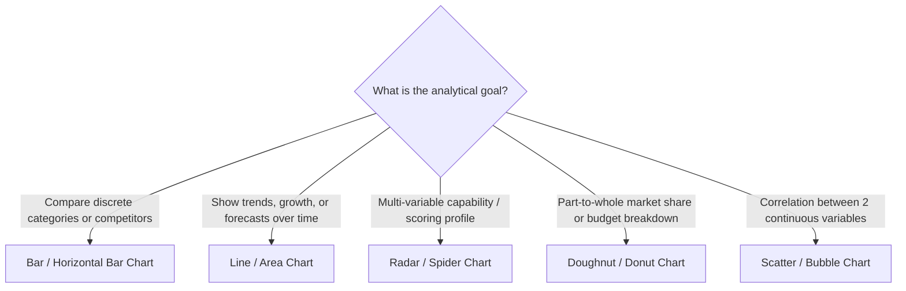

# Data Visualization Playbook

## 1. Objective
Standardize data presentation, visual analytics, and dashboard formatting across autonomous research agents. This playbook establishes strict rules for Chart.js graph configurations, markdown table alignments, KPI callout cards, and accessible dark-mode glassmorphism color palettes to ensure all outputs are publication-grade.

---

## 2. Methodology

### 2.1 Chart Type Selection Decision Tree
Agents MUST select chart types strictly based on the underlying data dimension and analytical intent:



#### Chart Selection & Configuration Rules:

| Chart Type | Best Used For | Configuration Mandates | Strict Anti-Patterns |
| :--- | :--- | :--- | :--- |
| **Bar Chart** | Sizing comparisons, ARR by tier, latency per hop | Set `beginAtZero: true`; sort descending by default; use horizontal bars if $>8$ categories | Do NOT truncate axis without explicit notation |
| **Line Chart** | 5-Year CAGR projections, monthly burn rate, historical revenue | Smooth curves (`tension: 0.35`); show points on hover; use dashed lines for forecasts | Do NOT plot $>4$ lines on one graph without highlights |
| **Radar Chart** | Competitor multi-axis scoring (e.g. speed, cost, security, UX) | Normalize all axes to a uniform scale (0 to 100 or 1 to 5); set `suggestedMin: 0, suggestedMax: 100` | Do NOT use raw mismatched units on different axes |
| **Doughnut Chart** | Market share composition, cap table ownership, budget allocation | Limit to $\le 6$ slices; aggregate smallest into "Other"; display total in center cutout | NEVER use 3D pie charts; do NOT use when values are near-equal |

---

### 2.2 Chart.js Dark-Mode Glassmorphism Configuration Standards
When generating JSON chart configurations for the NeuroWeave UI dashboard or HTML embeds, agents must adhere to the standard canvas theme:

```javascript
const chartConfig = {
  type: 'line', // or 'bar', 'radar', 'doughnut'
  data: {
    labels: ['2025', '2026', '2027', '2028', '2029', '2030'],
    datasets: [
      {
        label: 'Projected ARR ($M)',
        data: [2.2, 7.0, 18.5, 38.0, 68.0, 110.0],
        borderColor: '#6366F1', // Primary Accent (Indigo)
        backgroundColor: 'rgba(99, 102, 241, 0.15)', // Glassmorphism translucent fill
        borderWidth: 2.5,
        fill: true,
        tension: 0.35,
        pointBackgroundColor: '#818CF8',
        pointBorderColor: '#0F172A',
        pointRadius: 4,
        pointHoverRadius: 7
      }
    ]
  },
  options: {
    responsive: true,
    maintainAspectRatio: false,
    plugins: {
      legend: {
        position: 'top',
        labels: {
          color: '#E2E8F0', // Slate-200 text
          font: { family: "'Inter', sans-serif", size: 12, weight: '600' },
          padding: 16
        }
      },
      tooltip: {
        backgroundColor: 'rgba(15, 23, 42, 0.90)', // Dark slate translucent
        borderColor: 'rgba(255, 255, 255, 0.15)',
        borderWidth: 1,
        titleColor: '#F8FAFC',
        bodyColor: '#94A3B8',
        padding: 12,
        cornerRadius: 8,
        displayColors: true
      }
    },
    scales: {
      x: {
        grid: { color: 'rgba(255, 255, 255, 0.06)', drawBorder: false },
        ticks: { color: '#94A3B8', font: { family: "'Inter', sans-serif", size: 11 } }
      },
      y: {
        beginAtZero: true,
        grid: { color: 'rgba(255, 255, 255, 0.06)', drawBorder: false },
        ticks: { color: '#94A3B8', font: { family: "'Inter', sans-serif", size: 11 } }
      }
    }
  }
};
```

---

### 2.3 Data Table Alignment Standards
Tables in markdown and HTML reports must maintain consistent column alignment to maximize executive scannability:

| Column Content Type | Alignment Rule | Markdown Header Syntax | Example Format |
| :--- | :---: | :---: | :--- |
| **Descriptive Text / Entity Names** | **Left** | `:---` | `NeuroWeave Engine` |
| **Category / Methodology / Source** | **Left** | `:---` | `Enterprise SaaS (Tier 1)` |
| **Numerical Data / Currency / ARR** | **Right** | `---:` | `$14,250,000` or `78.4%` |
| **Latencies / Counts / Ratios** | **Right** | `---:` | `184ms` or `4.6x` |
| **Status Badges / Grades / Ratings** | **Center** | `:---:` | `VERIFIED` or `A+` |
| **Dates / Timeline Intervals** | **Center** | `:---:` | `2026-Q3` or `2025–2030` |

> [!NOTE]
> All financial amounts and numeric counters must use standard thousand separators (e.g., `1,250,000`, not `1250000`).

---

### 2.4 Executive Summary Callout & KPI Card Formatting
Executive summaries must utilize standardized UI cards and alert blocks.

#### KPI Card Grid Structure (HTML / UI Engine):
```html
<div class="kpi-grid" style="display: grid; grid-template-columns: repeat(4, 1fr); gap: 16px;">
  <div class="kpi-card" style="background: rgba(30, 41, 59, 0.7); backdrop-filter: blur(12px); border: 1px solid rgba(255, 255, 255, 0.1); border-radius: 12px; padding: 18px;">
    <div style="font-size: 12px; font-weight: 600; color: #94A3B8; text-transform: uppercase;">Total TAM (2030)</div>
    <div style="font-size: 26px; font-weight: 700; color: #F8FAFC; margin-top: 6px;">$18.35B</div>
    <div style="font-size: 13px; font-weight: 600; color: #10B981; margin-top: 4px;">▲ +34.2% CAGR</div>
  </div>
</div>
```

#### GitHub Markdown Fallback Format:
```markdown
> [!IMPORTANT]
> ### 📊 Strategic Execution Summary
> - **Total Addressable Market (2030)**: **$18.35B** (CAGR: `+34.2%`)
> - **Series A Recommended Valuation**: **$32.0M Pre-Money** (`20.00%` Dilution)
> - **P99 Operational Latency**: **288ms** (SLA Ceiling: `400ms`)
> - **Epistemic Confidence Score**: **0.94 / 1.00** (`100%` Math Reconciled)
```

---

### 2.5 Color Palette & Accessibility Standards

| Semantic Role | Hex Code | RGB & Opacity | Dark-Mode Contrast Ratio (on `#0F172A`) | Usage Context |
| :--- | :--- | :--- | :---: | :--- |
| **Primary Accent (Indigo)** | `#6366F1` | `rgba(99, 102, 241, 1.0)` | $6.8:1$ (WCAG AAA) | Primary series, active states, key buttons |
| **Secondary Accent (Cyan)** | `#06B6D4` | `rgba(6, 182, 212, 1.0)` | $7.4:1$ (WCAG AAA) | Secondary series, benchmark comparisons |
| **Positive / Growth (Emerald)** | `#10B981` | `rgba(16, 185, 129, 1.0)` | $8.1:1$ (WCAG AAA) | Revenue growth, verified claims, pass states |
| **Warning / Caution (Amber)** | `#F59E0B` | `rgba(245, 158, 11, 1.0)` | $7.9:1$ (WCAG AAA) | Moderate risk, unverified claims, latency alerts |
| **Negative / Severe (Rose/Red)** | `#EF4444` | `rgba(239, 68, 68, 1.0)` | $5.9:1$ (WCAG AA) | Churn, margin compression, red-team failures |
| **Surface Dark (Slate 900)** | `#0F172A` | `rgba(15, 23, 42, 0.85)` | Base Background | Glassmorphism card backgrounds |
| **Border Glass** | `#334155` | `rgba(255, 255, 255, 0.12)` | N/A | Translucent panel dividers and borders |

---

## 3. Key Metrics

| Metric | Target Standard | Critical Deficiency Alert |
| :--- | :--- | :--- |
| **Visual Contrast Ratio** | $\ge 4.5:1$ (WCAG AA compliant) | $< 3.0:1$ (Illegible on dark backgrounds) |
| **Information Density Score** | Key takeaway visible in $< 5\text{ seconds}$ | Visual clutter / un-scannable walls of text |
| **Table Alignment Consistency** | $100\%$ adherence to type-based alignment | Left-aligned numbers or right-aligned labels |
| **Chart Aspect Ratio** | $16:9$ or $2:1$ for desktop dashboards | Distorted stretching / overlapping labels |

---

## 4. Output Format Rules

1. **Embedded Chart.js Blocks**: Always include complete, valid JSON configuration objects wrapped in ````json ``` codeblocks when generating dashboard artifacts.
2. **Standardized Tables**: Use strict column alignment (`:---`, `---:`, `:---:`) across all tabular disclosures.
3. **Card Callouts**: Summarize primary analytical takeaways in high-contrast callout boxes before detailed technical sections.
4. **Accessible Labeling**: Every chart must feature explicit unit annotations on axes (e.g., `USD ($M)`, `Latency (ms)`, `Percentage (%)`).

---

## 5. Example Structure

```markdown
# Visual Intelligence Report: Multi-Agent Platform Performance & Growth

> [!IMPORTANT]
> ### 🚀 Executive Dashboard Summary
> - **Annual Run-Rate**: **$4.2M ARR** (`▲ +210% YoY`)
> - **LTV : CAC Efficiency**: **4.8x** (Payback: `8.2 months`)
> - **P99 Inference Latency**: **242ms** (Target: `< 350ms`)
> - **Epistemic Accuracy**: **98.4%** (`0` Hallucinations detected)

---

## 1. Key Performance Indicators

| Business Dimension | Actual (Q3 2026) | Target Benchmark | YoY Delta | Audit Status |
| :--- | ---: | ---: | ---: | :---: |
| **Enterprise ARR** | $4,200,000 | $3,500,000 | +210.0% | **EXCEEDS** |
| **Gross Margin** | 81.2% | 75.0% | +6.2% | **HEALTHY** |
| **Customer Acquisition Cost** | $11,500 | $15,000 | -23.3% | **EFFICIENT** |
| **Net Revenue Retention (NRR)** | 132.0% | 115.0% | +17.0% | **TOP TIER** |
| **P99 System Latency** | 242ms | 350ms | -30.8% | **OPTIMAL** |

---

## 2. Competitive Capabilities Radar Configuration

```json
{
  "type": "radar",
  "data": {
    "labels": ["Execution Speed", "Factual Accuracy", "Security / RBAC", "Unit Economics", "Developer UX"],
    "datasets": [
      {
        "label": "NeuroWeave Platform",
        "data": [95, 98, 92, 88, 94],
        "borderColor": "#6366F1",
        "backgroundColor": "rgba(99, 102, 241, 0.25)",
        "pointBackgroundColor": "#818CF8"
      },
      {
        "label": "Industry Baseline",
        "data": [65, 70, 60, 55, 72],
        "borderColor": "#06B6D4",
        "backgroundColor": "rgba(6, 182, 212, 0.15)",
        "pointBackgroundColor": "#22D3EE"
      }
    ]
  },
  "options": {
    "scales": {
      "r": {
        "suggestedMin": 0,
        "suggestedMax": 100,
        "ticks": { "stepSize": 20, "color": "#94A3B8" },
        "grid": { "color": "rgba(255, 255, 255, 0.08)" },
        "pointLabels": { "color": "#E2E8F0", "font": { "size": 12, "weight": "600" } }
      }
    }
  }
}
```
```
