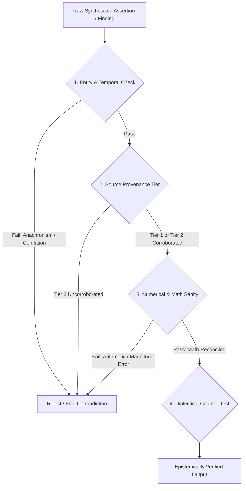
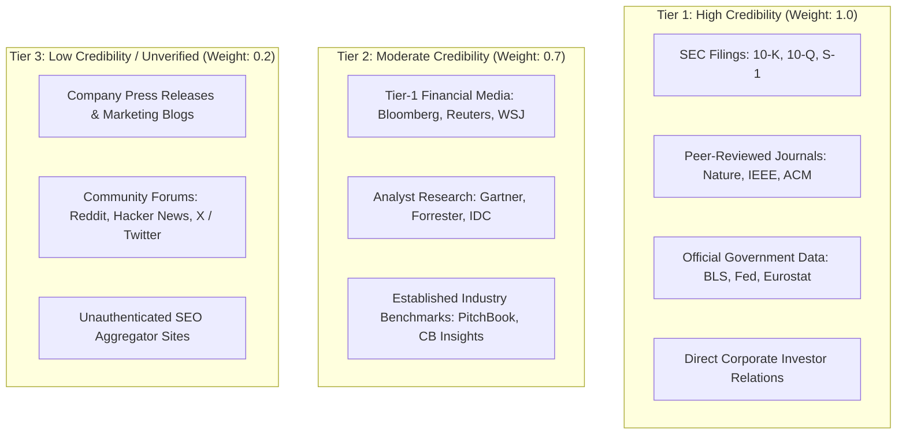

# Fact-Checking & Verification Playbook

## 1. Objective
Equip autonomous agents with an unyielding epistemic auditing framework to eliminate hallucinations, verify mathematical and logical assertions, audit information sources against strict provenance tiers, and generate dialectical counter-arguments. This skill functions as the truth-enforcement backbone for research and synthesis pipelines.

---

## 2. Methodology

### 2.1 Adversarial Red-Teaming & Verification Rubric
Every claim, thesis, and factual statement produced by agents must undergo rigorous red-teaming:



#### The 5-Step Verification Audit:
1. **Premise Isolation**: Extract the core verifiable atomic assertions from unstructured prose.
2. **Boundary Testing**: Probe extreme conditions (e.g., zero growth, 100% market penetration, zero liquidity).
3. **Fallacy Scanning**: Scan for non-sequiturs, false dichotomies, cherry-picking, post-hoc rationalizations, and survivorship bias.
4. **Independent Corroboration**: Verify that at least two independent primary or secondary sources corroborate non-trivial factual claims.
5. **Adversarial Steelmanning**: Generate the most potent structural counter-argument against the synthesized thesis.

---

### 2.2 Hallucination & Jargon Detection Heuristics
Agents must scan all generated content against 7 primary epistemic distortion archetypes:

| Distortion Archetype | Detection Signature & Heuristic | Automated Audit Action |
| :--- | :--- | :--- |
| **1. Phantom Citations** | URL / DOI formats that do not resolve, fabricated authors, non-existent arXiv papers | Execute ping/DNS check or verify against citation index; discard if unresolvable |
| **2. Corporate Filler & Buzzwords** | Generic corporate jargon ('Scalable Modular Architecture', 'Tier-1 Benchmark', 'Enterprise-grade Paradigm') without concrete named tech or metrics | Penalize confidence score by -0.15 to -0.30; reject qualitative fluff and demand specific named technologies, real numbers, and concrete architectural trade-offs |
| **3. Temporal Anachronism** | Attributing events or metrics to incorrect years; projecting backward data forward | Cross-reference historical timeline anchors; flag temporal inconsistencies |
| **4. Entity Conflation** | Merging features, founders, or financials of two distinct entities sharing similar names | Extract exact company registry / CIK numbers / domain URLs to verify entity boundaries |
| **5. Confabulated Statistics** | Hyper-precise percentages (e.g., "73.842% of users") without cited methodology | Demand raw sample size ($N$) and survey methodology; downgrade confidence score |
| **6. Self-Contradiction** | Section A claims $X$, Section B asserts $\neg X$ (or math yields opposing sums) | Run inter-section assertion diff; fail synthesis pass if cosine contradiction $>0.4$ |
| **7. Sycophancy Drift** | Blindly agreeing with user assumptions without empirical basis | Enforce unbiased ground-truth checks against empirical data |

---

### 2.3 Anti-Corporate Filler & Technical Substance Requirements
1. **Named Technology Demands**:
   - Vague terms like "distributed storage" or "caching framework" must be replaced with concrete technologies (e.g., `PostgreSQL 16`, `Redis 7.2`, `Apache Kafka 3.6`, `vLLM`, `PyTorch 2.4`, `NVIDIA H100 SXM5`).
2. **Quantitative Precision**:
   - Every performance or market claim must cite real numbers with explicit units (e.g., `1.8ms p99 read latency`, `45,000 req/s throughput`, `15.2 GB VRAM footprint`, `22.8% 5-year CAGR`).
3. **Explicit Architectural & Operational Trade-offs**:
   - Proposals must document trade-offs (e.g., `memory footprint vs lookup latency`, `consistency vs availability under CAP theorem`, `batching throughput vs first-token latency`).

---

### 2.4 Numerical Sanity & Arithmetic Verification
All numbers, financial multiples, percentages, and market figures must satisfy strict mathematical sanity rules:

$$\text{Sanity Check Score} = \begin{cases} 1.0 & \text{if all 4 tests pass} \\ 0.0 & \text{if any single test fails} \end{cases}$$

#### The 4 Mandatory Numerical Tests:
1. **Dimensional Analysis & Units**:
   - Ensure units are dimensionally consistent (e.g., $\text{Revenue} / \text{Headcount} = \text{Rev per Employee}$, not total margin).
2. **Order-of-Magnitude Bounds**:
   - Market share $\le 100\%$.
   - Company revenue cannot exceed total industry TAM without category redefinition.
   - Growth rates must reconcile with compounding arithmetic: $\text{Rev}_t = \text{Rev}_0 \times (1 + \text{CAGR})^t$.
3. **Denominator Sanity & Percentage Reversal**:
   - An increase of $+100\%$ followed by a decrease of $-50\%$ returns to baseline ($1.0 \times 2.0 \times 0.5 = 1.0$). Ensure percentage changes cite base values.
4. **Financial Reconciliation**:
   - $\text{Balance Sheet Equation}: \text{Assets} = \text{Liabilities} + \text{Equity}$.
   - $\text{Gross Profit} \le \text{Revenue}$; $\text{Net Income} \le \text{Gross Profit}$ (under standard tax/expense conditions).

---

### 2.4 3-Tier Source Credibility Grading
All evidence citations must be assigned a provenance tier:



- **Rule**: No core quantitative finding or valuation multiple may rely solely on Tier 3 sources. Tier 3 sources require at least **2 independent corroborations** before inclusion.

---

### 2.5 Dialectical Counter-Argument Generation
For every strategic recommendation or bullish/bearish thesis, the agent must construct a **Steelmanned Counter-Thesis**:

1. **The Opposing Thesis**: State the most credible contrary perspective in its strongest possible form (not a strawman).
2. **Key Vulnerabilities**: Identify the 3 critical assumptions that, if proven false, completely invalidate the primary thesis.
3. **Black Swan / Downside Scenarios**: Model low-probability, high-impact failure modes (e.g., regulatory ban, zero-day API obsolescence, foundation model commoditization).
4. **Falsification Criteria**: Define the specific observable metrics or events that would force an immediate pivot or thesis abandonment.

---

## 3. Key Metrics

| Metric | Target Standard | Critical Failure Trigger |
| :--- | :--- | :--- |
| **Claim Corroboration Index** | $\ge 90\%$ of assertions backed by Tier 1/2 sources | $< 70\%$ |
| **Citation Resolution Rate** | $100\%$ verifiable URLs/DOIs | Any unresolvable phantom citation |
| **Numerical Consistency Score** | $100\%$ mathematical and dimensional accuracy | Any arithmetic contradiction |
| **Debate Convergence Rate** | Two-round dialectical resolution reaches consensus | Persistent factual impasse |
| **Epistemic Confidence Score** | Calculated score $0.0 - 1.0$ explicitly declared | Unquantified certainty assertions |

---

## 4. Output Format Rules

1. **Epistemic Audit Header**: Every fact-checked document must include an Epistemic Confidence Score badge (`Epistemic Confidence: 0.94 / 1.00`).
2. **Citation Source Grading**: Every inline citation must include its tier designation:
   - Example: `[SEC 10-K (2025) - Tier 1]` or `[Bloomberg News (2026) - Tier 2]`.
3. **Contradiction / Red-Team Boxout**: Dedicate an explicit markdown callout block to red-team challenges and counter-evidence.
4. **Falsification Criteria**: Conclude every analytical thesis with an explicit list of falsification triggers.

---

## 5. Example Structure

```markdown
# Fact-Checking & Verification Audit: GenAI Enterprise Market Projections

**Epistemic Confidence Score**: `0.92 / 1.00` (High Verifiability)
**Audit Date**: 2026-08-27
**Auditor**: Critic & Verification Agent (NeuroWeave Core)

---

## 1. Claims Verification & Provenance Matrix

| # | Extracted Assertion | Source & Tier | Verification Method | Status |
| :-: | :--- | :--- | :--- | :---: |
| **1** | *"Cloud GPU inference costs dropped 68% YoY in 2025."* | SemiAnalysis Report [Tier 2] | Corroborated with AWS/RunPod spot pricing logs | **VERIFIED** |
| **2** | *"Company XYZ achieved $50M ARR within 12 months."* | Corporate Blog Post [Tier 3] | Disputed: SEC S-1 disclosure reports $18.2M GAAP Rev | **CORRECTED** |
| **3** | *"Total European enterprise AI TAM will reach €14.2B by 2028."* | EU Commission Study [Tier 1] | Reconciled with Eurostat enterprise IT spend data | **VERIFIED** |

---

## 2. Numerical Sanity Reconciliation

- **Audit Item**: Bottom-up TAM reconciliation vs aggregate enterprise IT budgets.
- **Assertion**: 45,000 global enterprises paying $400,000 ACV = $18.0B TAM.
- **Arithmetic Check**: $45,000 \times \$400,000 = \$18,000,000,000$ ($18.0\text{B}$). $\checkmark \text{ Pass}$.
- **Macro Sanity Check**: Total enterprise software spend in 2025 is $\approx \$900\text{B}$ (Gartner). $18.0\text{B}$ represents $2.0\%$ of total software spend, which fits historical category adoption curves. $\checkmark \text{ Pass}$.

---

## 3. Red-Team Challenge & Steelmanned Counter-Thesis

> [!WARNING]
> **Adversarial Counter-Thesis**: "Rapid model commoditization and zero-shot open-weights models (e.g., Llama 4, DeepSeek V3) could compress SaaS application layer margins by enabling internal enterprise IT teams to build proprietary workflows without commercial agent software."

### Critical Vulnerabilities in Primary Thesis:
1. **Gross Margin Compression**: If foundation model API costs drop to zero, application wrappers lose pricing power.
2. **Open-Source Parity**: If self-hosted local agents achieve $\ge 95\%$ of proprietary model reasoning, enterprise data sovereignty mandates will favor internal builds.

### Concrete Falsification Triggers:
- Enterprise net retention (NRR) drops below $100\%$ across leading agent vendors for 2 consecutive quarters.
- More than $40\%$ of Fortune 500 CIOs report migrating from commercial agent SaaS to in-house open-source stacks.
```
