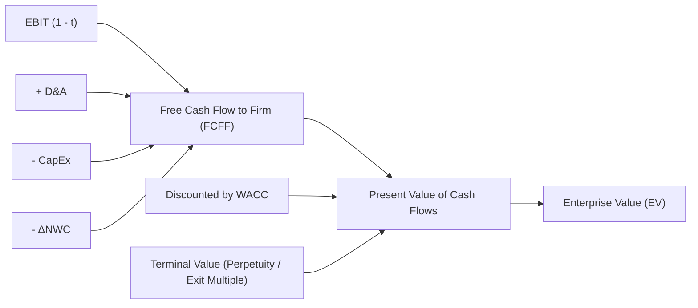

# Financial Valuation Playbook

## 1. Objective
Provide autonomous agents with a quantitative framework for rigorous company valuation, early-stage venture underwriting, unit economics auditing, and capitalization table modeling. This playbook ensures all financial synthesis adheres to corporate finance principles (CFA Institute & Wall Street standards).

---

## 2. Methodology

### 2.1 Discounted Cash Flow (DCF) Analysis
DCF modeling calculates the intrinsic enterprise value of an asset based on projected Unlevered Free Cash Flows (FCFF) discounted at the Weighted Average Cost of Capital (WACC).



#### A. Free Cash Flow to Firm (FCFF) Formula
$$\text{FCFF} = \text{EBIT} \times (1 - t) + \text{D\&A} - \text{CapEx} - \Delta \text{NWC}$$
Where:
- $t = \text{Effective Corporate Tax Rate}$
- $\text{D\&A} = \text{Depreciation \& Amortization}$
- $\text{CapEx} = \text{Capital Expenditures}$
- $\Delta \text{NWC} = \text{Change in Non-Cash Net Working Capital}$

#### B. Weighted Average Cost of Capital (WACC)
$$\text{WACC} = \left(\frac{E}{V} \times K_e\right) + \left(\frac{D}{V} \times K_d \times (1 - t)\right)$$
$$\text{Cost of Equity } (K_e) = R_f + \beta \times \text{ERP}$$
Where:
- $R_f = \text{Risk-Free Rate (10-Yr US Treasury)}$
- $\beta = \text{Asset Levered Beta}$
- $\text{ERP} = \text{Equity Risk Premium } (4.5\% - 6.0\%)$
- $K_d = \text{Pre-Tax Cost of Debt}$
- $E/V, D/V = \text{Equity and Debt proportions of Total Enterprise Capital}$

#### C. Terminal Value (TV) Computation
Calculate using both methods and average or present as a sensitivity range:
1. **Gordon Growth Method (Perpetuity)**:
   $$\text{TV}_{\text{growth}} = \frac{\text{FCFF}_{n+1}}{\text{WACC} - g} = \frac{\text{FCFF}_n \times (1 + g)}{\text{WACC} - g} \quad (g \le \text{Long-term GDP growth, typically } 2.0\% - 2.5\%)$$
2. **Exit Multiple Method**:
   $$\text{TV}_{\text{multiple}} = \text{Metric}_n \times \text{Target Exit Multiple} \quad (\text{e.g., Year } n \text{ EBITDA} \times 12.0\text{x})$$

$$\text{Enterprise Value (EV)} = \sum_{t=1}^{n} \frac{\text{FCFF}_t}{(1 + \text{WACC})^t} + \frac{\text{TV}}{(1 + \text{WACC})^n}$$
$$\text{Equity Value} = \text{Enterprise Value} + \text{Cash} - \text{Total Debt} - \text{Minority Interest}$$

---

### 2.2 Comparable Company Analysis & Valuation Multiples
Evaluate market-relative value using standardized trading and transaction comps:

| Multiple | Target Asset Class | Use Case & Formula | Normalization Rule |
| :--- | :--- | :--- | :--- |
| **EV / ARR (or EV / NTM Rev)** | High-Growth SaaS / Tech | $\frac{\text{Enterprise Value}}{\text{Next Twelve Months Revenue}}$ | Disclose gross margin hurdle ($>75\%$) |
| **EV / EBITDA** | Cash-Flow Positive B2B | $\frac{\text{Enterprise Value}}{\text{EBITDA (LTM / NTM)}}$ | Adjust for one-off restructuring and stock comp |
| **P / E (Price to Earnings)** | Mature Public Equities | $\frac{\text{Market Capitalization}}{\text{Net Income}}$ | Exclude extraordinary gains / tax adjustments |
| **Rule of 40** | Venture SaaS Growth | $\text{YoY Revenue Growth Rate (\%)} + \text{Free Cash Flow Margin (\%)}$ | Target $\ge 40\%$ |

---

### 2.3 Unit Economics & Growth Efficiency
For subscription and transactional business models, agents must compute:

#### A. Customer Lifetime Value (LTV)
$$\text{LTV} = \frac{\text{ARPU} \times \text{Gross Margin (\%)}}{\text{Customer Churn Rate}}$$
*(For cohort expansion models: $\text{LTV} = \frac{\text{ARPU} \times \text{Gross Margin}}{\text{Net Churn}}$)*

#### B. Customer Acquisition Cost (CAC) & Payback Period
$$\text{CAC} = \frac{\text{Total Fully-Loaded S\&M Spend in Period } t}{\text{New Customers Acquired in Period } t}$$
$$\text{CAC Payback (Months)} = \frac{\text{CAC}}{\text{ARPU (Monthly)} \times \text{Gross Margin (\%)}}$$

#### C. Magic Number & Net Revenue Retention (NRR)
$$\text{SaaS Magic Number} = \frac{(\text{Quarterly ARR}_Q - \text{Quarterly ARR}_{Q-1}) \times 4}{\text{S\&M Spend}_{Q-1}}$$
- $\text{Magic Number} > 1.0$: Highly efficient, accelerate S&M spend.
- $\text{Magic Number} 0.75 - 1.0$: Healthy efficiency.
- $\text{Magic Number} < 0.75$: Inefficient sales engine; fix onboarding/product-market fit.

$$\text{NRR} = \frac{\text{Starting ARR} + \text{Expansions} - \text{Contractions} - \text{Churn}}{\text{Starting ARR}} \times 100\%$$

---

### 2.4 Cap Table Modeling & Dilution Mechanics
Model ownership distributions across financing rounds incorporating Option Pool Shuffles and SAFE / Convertible conversions.

#### A. Pre-Money vs Post-Money Math
$$\text{Post-Money Valuation} = \text{Pre-Money Valuation} + \text{New Investment Amount}$$
$$\text{New Investor Ownership (\%)} = \frac{\text{Investment Amount}}{\text{Post-Money Valuation}}$$
$$\text{Existing Shareholder Dilution (\%)} = 1 - \text{New Investor Ownership}$$

#### B. Unallocated Option Pool Shuffle
When lead investors require an unallocated employee pool (e.g., $10\% - 15\%$ post-round), the pool MUST be carved out **pre-money**, diluting only existing founders/employees:
$$\text{Effective Pre-Money Valuation} = \text{Negotiated Pre-Money} \times (1 - \text{Target Option Pool \%})$$

#### C. SAFE Conversion Mechanics
- **Valuation Cap**: $\text{Conversion Price} = \frac{\text{Valuation Cap}}{\text{Total Pre-Round Company Capitalization}}$
- **Discount Rate**: $\text{Discount Price} = \text{Series A Price Per Share} \times (1 - \text{Discount \%})$
- **Actual Conversion**: Investor receives the lower of the Conversion Price or Discount Price.

---

### 2.5 Venture Capital Round Rules (Seed & Series A)

| Round Stage | Typical ARR Run-Rate | YoY Growth Expectation | Target Dilution | Typical Round Size | Key Underwriting Milestone |
| :--- | :--- | :--- | :--- | :--- | :--- |
| **Pre-Seed** | $\$0 - \$100\text{k}$ | N/A (Idea / Prototype) | $10\% - 15\%$ | $\$500\text{k} - \$1.5\text{M}$ | Functional MVP + Early Beta Feedback |
| **Seed** | $\$100\text{k} - \$1.0\text{M}$ | $>3.0\text{x YoY}$ | $15\% - 20\%$ | $\$2.0\text{M} - $\$4.5\text{M}$ | Proven ICP product-market fit + positive cohort retention |
| **Series A** | $\$1.5\text{M} - \$4.0\text{M}$ | $>2.5\text{x - } 3.0\text{x YoY}$ | $18\% - 25\%$ | $\$8.0\text{M} - $\$15.0\text{M}$ | Repeatable GTM motion, LTV:CAC $\ge 3.0$, NRR $\ge 115\%$ |
| **Series B** | $\$5.0\text{M} - $\$12.0\text{M}$ | $>2.0\text{x YoY}$ | $15\% - 20\%$ | $\$20.0\text{M} - $\$40.0\text{M}$ | Multi-product expansion, unit economics at scale |

---

## 3. Key Metrics

| Metric | Healthy Benchmark Range | Distress / Reject Threshold |
| :--- | :--- | :--- |
| **LTV : CAC Ratio** | $3.0\text{x} - 5.0\text{x}$ | $<2.0\text{x}$ (Negative unit economic trajectory) |
| **CAC Payback Period** | $8 - 14\text{ months}$ | $>24\text{ months}$ |
| **Gross Margin** | Pure SaaS: $\ge 75\%$; AI Infrastructure: $\ge 60\%$ | $<50\%$ |
| **Net Revenue Retention (NRR)** | Enterprise: $>120\%$; Mid-Market: $>105\%$ | $<90\%$ |
| **Burn Multiple** | Net Burn / Net New ARR: $<1.2\text{x}$ | $>2.5\text{x}$ (Severe cash inefficiency) |

---

## 4. Output Format Rules

1. **Valuation Sensitivity Matrix**: Any DCF or Multiples output must include a 2-way sensitivity table (e.g., WACC vs Terminal Growth Rate, or Exit Multiple vs Discount Rate).
2. **Cap Table Precision**: Dilution percentages must be rendered to two decimal places (`XX.XX%`), and share counts must be represented as whole numbers.
3. **Currency & Units**: All financial totals must explicitly state currency and magnitude (e.g., `$12.5M USD` or `€4.2B EUR`).
4. **Formula Transparency**: Show step-by-step arithmetic when calculating conversion share prices and pre/post dilution.

---

## 5. Example Structure

```markdown
# Valuation Report: NeuralMatrix AI Inc. (Series A Underwriting)

## Executive Summary
> **Valuation Recommendation**: Recommend a **$32.0M Pre-Money Valuation** ($40.0M Post-Money on an $8.0M Series A raise), resulting in 20.00% lead investor ownership. Valuation is justified by a 14.5x EV/ARR multiple against $2.2M ARR (growing 3.2x YoY) and exceptional unit economics (LTV/CAC: 4.6x, Payback: 9.4 months).

---

## 1. Unit Economics & Efficiency Metrics

| Metric | Actual | Series A Benchmark | Status |
| :--- | ---: | ---: | :---: |
| **Annual Recurring Revenue (ARR)** | $2,200,000 | $1,500,000 - $3,000,000 | Top Quartile |
| **YoY Revenue Growth Rate** | 220% (3.2x) | >200% | Exceeds |
| **Gross Margin** | 78.4% | >75.0% | Healthy |
| **Customer Acquisition Cost (CAC)** | $12,400 | <$18,000 | Efficient |
| **Average Revenue Per Account (ARPA)** | $19,800 / yr | N/A | Mid-Market |
| **LTV / CAC Ratio** | 4.6x | >3.0x | Excellent |
| **CAC Payback Period** | 9.5 months | <12.0 months | Top Decile |
| **Net Revenue Retention (NRR)** | 128.5% | >115.0% | Exceptional |
| **Rule of 40 Score** | 220% - 15% = 205% | >40.0% | Elite |

---

## 2. Cap Table & Dilution Schedule

| Shareholder / Class | Pre-Round Shares | Pre-Round % | Post-Round Shares | Post-Round % | Fully-Diluted Value |
| :--- | ---: | ---: | ---: | ---: | ---: |
| **Founders (Common)** | 7,000,000 | 70.00% | 7,000,000 | 56.00% | $22,400,000 |
| **Seed Investors (Preferred)** | 1,800,000 | 18.00% | 1,800,000 | 14.40% | $5,760,000 |
| **Unallocated ESOP (Pre-Round Shuffle)** | 1,200,000 | 12.00% | 1,200,000 | 9.60% | $3,840,000 |
| **Series A Lead Investor** | 0 | 0.00% | 2,500,000 | 20.00% | $8,000,000 |
| **Total Fully-Diluted Capitalization** | **10,000,000** | **100.00%** | **12,500,000** | **100.00%** | **$40,000,000** |

---

## 3. DCF Sensitivity Matrix ($M Enterprise Value)

| WACC \ Perpetual Growth ($g$) | 1.5% | 2.0% | 2.5% | 3.0% |
| :--- | ---: | ---: | ---: | ---: |
| **10.0%** | $39.2M | $42.5M | $46.8M | $51.9M |
| **11.5%** | $34.1M | $36.8M | $40.1M | $44.2M |
| **13.0%** | $29.8M | **$32.0M** | $34.7M | $37.9M |
| **14.5%** | $26.2M | $28.0M | $30.2M | $32.8M |
```
