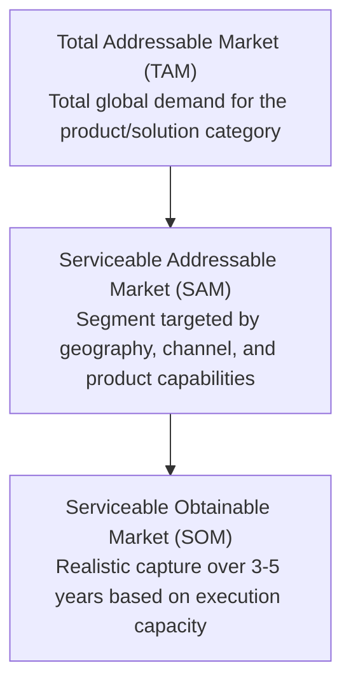

# Market Analysis Playbook

## 1. Objective
Guide autonomous agents in executing exhaustive, mathematically sound, and commercially rigorous market research. This playbook establishes standardized protocols for sizing addressable markets, evaluating competitive landscapes, stress-testing industry dynamics via Porter's Five Forces, defining Ideal Customer Profiles (ICPs), and modeling compound annual growth rates (CAGR).

---

## 2. Methodology

### 2.1 Market Sizing Framework (TAM, SAM, SOM)
Agents MUST calculate market size using both **Top-Down** and **Bottom-Up** methodologies and triangulate the results. Single-source estimates are strictly disallowed.



#### A. Top-Down Sizing Formulation
$$\text{TAM}_{\text{top-down}} = \text{Global Industry Spend} \times \text{Applicable Sub-sector Share}$$
$$\text{SAM}_{\text{top-down}} = \text{TAM} \times \text{Geographic Filter (\%)} \times \text{Target Segment Filter (\%)} \times \text{Channel Fit (\%)} $$
$$\text{SOM}_{\text{top-down}} = \text{SAM} \times \text{Target Market Share (\% within 36-60 months)}$$

#### B. Bottom-Up Sizing Formulation (Primary Source of Truth)
$$\text{TAM}_{\text{bottom-up}} = \text{Total Potential Customer Accounts in Universe} \times \text{Annual Contract Value (ACV)}$$
$$\text{SAM}_{\text{bottom-up}} = \text{Qualified Target Accounts (ICP Match in Accessible Regions)} \times \text{ACV}$$
$$\text{SOM}_{\text{bottom-up}} = (\text{Sales Rep Capacity} \times \text{Win Rate} \times \text{ACV}) + (\text{Inbound Conversion} \times \text{ACV})$$

#### C. Triangulation & Variance Check
- If $|\text{TAM}_{\text{top-down}} - \text{TAM}_{\text{bottom-up}}| / \text{TAM}_{\text{bottom-up}} > 0.35$, the agent MUST document specific variance drivers (e.g., pricing disparity, uncaptured adjacent segments, differing ACV assumptions).

---

### 2.2 Competitor Benchmarking Matrix
Map key market players across capability tiers and defensibility moats:

1. **Direct Competitors**: Identical value proposition, targeting identical ICP.
2. **Indirect Competitors**: Alternate approach solving the same core problem.
3. **Emerging/Disruptive Competitors**: Open-source, self-hosted, or downmarket entrants with potential to move upmarket.

#### Evaluation Dimensions:
- **Feature Completeness**: Core product parity vs differentiation vectors (0-100% score).
- **Pricing & Packaging**: Pricing model (Usage-based, Seat-based, Platform tier, Enterprise quote-only), entry ACV, and margin posture.
- **Go-To-Market (GTM) Velocity**: Self-serve PLG vs Field Sales Motion, sales cycle duration, channel partner network.
- **Moat & Defensibility**: Data network effects, switching costs, proprietary algorithms/IP, regulatory approvals.

---

### 2.3 Porter's Five Forces Evaluation
Assess industry attractiveness by scoring each force on a 1 (Low Threat / High Margin Potential) to 5 (Severe Threat / Margin Compression) scale:

| Force | Evaluation Criteria | Scoring Guidelines (1-5) |
| :--- | :--- | :--- |
| **1. Threat of New Entrants** | Capital requirements, regulatory barriers, brand loyalty, API distribution moats | 1 = High moat / high capital barrier; 5 = Zero capital required / commoditized code |
| **2. Bargaining Power of Suppliers** | Single cloud provider dependency, proprietary hardware chips (e.g., GPU scarcity), talent pool concentration | 1 = Plentiful commodity inputs; 5 = Monopolistic supplier pricing power |
| **3. Bargaining Power of Buyers** | Buyer concentration, availability of drop-in open-source substitutes, contract switching costs | 1 = Fragmented buyers / high switching costs; 5 = Enterprise whale dominance / zero lock-in |
| **4. Threat of Substitutes** | Internal DIY build teams, manual human workflows, legacy spreadsheets, adjacent category expansions | 1 = No viable workaround; 5 = Existing tools easily stretched to replace function |
| **5. Industry Rivalry** | Number of well-funded VC competitors, price wars, race to the bottom on feature bundling | 1 = Monopoly/Duopoly; 5 = Hyper-fragmented red ocean |

$$\text{Structural Industry Score} = \frac{\sum_{i=1}^{5} \text{Force}_i}{5}$$
- **Score $\le 2.2$**: Highly attractive, high gross margin defensibility.
- **Score $2.3 - 3.5$**: Moderately competitive, execution-driven margins.
- **Score $> 3.5$**: Structurally challenged, intense margin compression.

---

### 2.4 Customer Persona & ICP Architecture
Structure buyer and user profiles into actionable segments:

- **Ideal Customer Profile (ICP)**:
  - Firmographic filters: Company size (Employees, ARR), Tech Stack maturity, Geo, Industry Vertical.
  - Pain Trigger: Quantified financial loss, compliance deadline, or compute/operational bottleneck.
- **Buyer Persona vs User Persona**:
  - **Economic Buyer**: Title, budget authority, ROI threshold required for approval, key veto criteria.
  - **Internal Champion / Power User**: Day-to-day workflow friction, feature wishlist, adoption objections.
  - **Procurement & InfoSec Gatekeeper**: SOC2/ISO requirements, data residency, SLA penalties.

---

### 2.5 CAGR Growth Modeling & Macro Catalysts
Forecast market growth using compound annual growth rate calculations over 3-year and 5-year horizons:

$$\text{CAGR}_{t_0 \to t_n} = \left( \frac{\text{Value}_{t_n}}{\text{Value}_{t_0}} \right)^{\frac{1}{n}} - 1$$

Categorize catalysts into four vectors:
1. **Technological Accelerators**: Cloud migration, LLM inference latency drops, edge compute maturation.
2. **Regulatory & Compliance Drivers**: Mandates (GDPR, EU AI Act, HIPAA, SEC cyber disclosure).
3. **Macroeconomic Tailwinds/Headwinds**: IT budget tightening, cost-efficiency focus vs innovation spend.
4. **Supply Chain & Infrastructure Enablers**: Bandwidth, silicon availability, open-weights foundation models.

---

## 3. Key Metrics

| Metric | Target / Healthy Benchmark | Critical Warning Signal |
| :--- | :--- | :--- |
| **SOM Capture Rate (Yr 3)** | $1.5\% - 5.0\%$ of SAM | $>15\%$ in Year 1-2 (Unrealistic execution model) |
| **5-Yr Market CAGR** | $>12\%$ for Growth SaaS; $>25\%$ for GenAI/DeepTech | $<5\%$ (Stagnant category unless taking pure share) |
| **Competitive Win Rate** | $30\% - 45\%$ in competitive bake-offs | $<20\%$ (Feature gap or misaligned pricing) |
| **Switching Cost Moat Index** | $>3.5 / 5.0$ | $<2.0$ (High churn vulnerability) |
| **Payback Period by ICP Tier** | Mid-Market: $<12\text{ mos}$; Enterprise: $<18\text{ mos}$ | $>24\text{ mos}$ without long-term lock-in |

---

## 4. Output Format Rules

1. **Executive Summary Callout**: Every market analysis artifact must lead with an `Executive Summary Callout` including:
   - TAM / SAM / SOM summary table
   - Primary 5-Year CAGR forecast
   - 3-point Competitive Advantage verdict
2. **Comparative Data Tables**:
   - Numeric fields (Market size in USD, percentages) MUST be right-aligned.
   - Competitor comparison tables MUST feature at least 4 comparable dimensions.
3. **Evidence Citations**: Every market sizing input and external market share figure MUST be attributed to a verifiable source with tier grading (e.g., `[Gartner 2025 - Tier 1]`).
4. **Markdown Formatting**: Use clean GitHub Flavored Markdown with Mermaid diagrams for market breakdown or positioning maps.

---

## 5. Example Structure

```markdown
# Market Analysis: Enterprise Autonomous AI Agents (2025–2030)

## Executive Summary
> **Market Verdict**: The Autonomous Enterprise Agent category exhibits strong tailwinds with a projected 5-year CAGR of 34.2%, driven by enterprise automation mandates and reasoning model efficiency gains. Total Addressable Market expands from $4.2B (2025) to $18.3B (2030).

---

## 1. TAM / SAM / SOM Market Sizing

| Sizing Tier | Global Market Value | Bottom-Up Calculation Basis | Target Horizon |
| :--- | ---: | :--- | :--- |
| **TAM (Total Addressable)** | $18,350M | 45,000 Global Enterprises × $407,700 Avg Potential Spend | 2030 (Global) |
| **SAM (Serviceable Addressable)** | $4,120M | 12,500 NA & EMEA Tech/Finance Enterprises × $329,600 ACV | 2027 (Regional) |
| **SOM (Serviceable Obtainable)** | $145M | 380 Enterprise Wins × $381,500 Realized Year-3 ACV | 2027 (Year 3) |

---

## 2. Porter's Five Forces Assessment

| Force | Score (1-5) | Key Structural Driver | Strategic Countermeasure |
| :--- | :---: | :--- | :--- |
| **Threat of New Entrants** | 3.8 | Low open-source code barrier for basic wrappers | Proprietary memory graph + SOC2 compliance moat |
| **Supplier Power** | 4.2 | Foundation model API pricing and token rate limits | Multi-provider router + local open-weight fallback |
| **Buyer Power** | 2.5 | Enterprise buyers require deep integration & SLAs | High workflow lock-in via custom tool connectors |
| **Threat of Substitutes**| 3.1 | Internal developer platform teams building DIY tools | Lower TCO and 10x faster deployment time |
| **Industry Rivalry** | 4.0 | Rapid proliferation of early-stage agent startups | Focus on verified deterministic outputs and evaluation |

**Overall Structural Score**: `3.52 / 5.0` (Execution & Moat Sensitive)

---

## 3. Ideal Customer Profile (ICP) Matrix

```json
{
  "icp_profile": {
    "tier": "Enterprise Tier 1",
    "firmographics": {
      "revenue_range": "$100M - $2B",
      "employee_count": "1,000 - 15,000",
      "industries": ["Fintech", "HealthTech", "Enterprise SaaS"]
    },
    "economic_buyer": {
      "title": "Chief Technology Officer / VP of Engineering",
      "primary_kpi": "Engineering velocity and automated compliance audit rate",
      "budget_authority": "$250,000+"
    },
    "jobs_to_be_done": [
      "Automate multi-step financial due diligence without hallucination",
      "Synthesize real-time competitor research with verifiable citations"
    ]
  }
}
```
```
