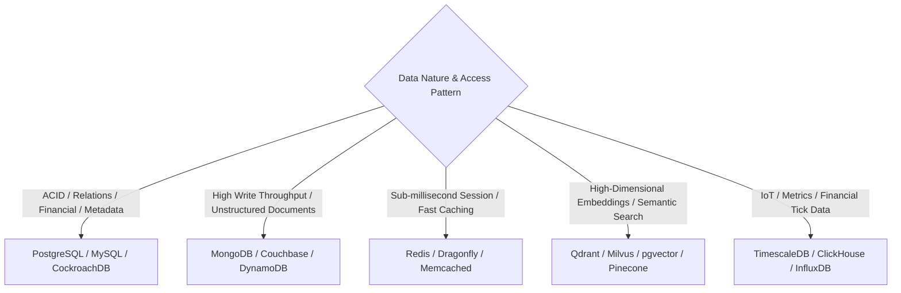
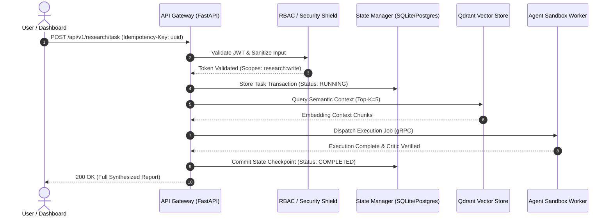

# Technical Architecture Playbook

## 1. Objective
Establish definitive engineering patterns and architectural decision frameworks for autonomous agents evaluating or synthesizing software systems. This playbook provides rigorous criteria for fault tolerance, data store selection, latency budgeting, decomposition trade-offs, and enterprise API specifications.

---

## 2. Methodology

### 2.1 High-Availability (HA) & Fault-Tolerant System Design
Architectures must eliminate Single Points of Failure (SPOF) and enforce automated recovery across multi-zone/multi-region deployments.

```mermaid
graph TD
    Client[Global Clients] --> GSLB[Global Server Load Balancer / Anycast DNS]
    GSLB --> RegionA[Primary Region: Active]
    GSLB --> RegionB[Secondary Region: Active/Standby]
    
    subgraph "Region A Topology"
        ALB_A[App Load Balancer + WAF] --> Ingress_A[API Gateway / Envoy]
        Ingress_A --> SvcMesh_A[Service Mesh: Istio]
        SvcMesh_A --> App_A[Stateless Container Pods (HPA: 3-50 replicas)]
        App_A --> Redis_A[(Redis Cluster: Sentinel)]
        App_A --> DB_Primary[(PostgreSQL Primary)]
    end
    
    subgraph "Region B Topology"
        ALB_B[App Load Balancer + WAF] --> Ingress_B[API Gateway / Envoy]
        Ingress_B --> SvcMesh_B[Service Mesh: Istio]
        SvcMesh_B --> App_B[Stateless Container Pods]
        App_B --> Redis_B[(Redis Cluster)]
        App_B --> DB_Replica[(PostgreSQL Standby Replica)]
    end
    
    DB_Primary -.->|Async / Sync Stream Replication| DB_Replica
```

#### Resilience Patterns & SLA Targets:
- **Redundancy Level**: $N+1$ minimal for local node failures; $2N$ or Multi-Region Active-Active for 99.99% ("four nines") availability.
- **Circuit Breakers & Bulkheads**: Wrap all downstream RPC and third-party API calls in circuit breakers (e.g., Netflix Hystrix / Resilience4j pattern) with fallbacks.
- **Disaster Recovery Targets**:
  - **RTO (Recovery Time Objective)**: Target $< 60\text{ seconds}$ for automated failover.
  - **RPO (Recovery Point Objective)**: Target $< 5\text{ seconds}$ (near-zero data loss replication lag).

---

### 2.2 Architectural Topology: Microservices vs. Modular Monolith

| Dimension | Modular Monolith | Microservices Architecture | Decision Trigger |
| :--- | :--- | :--- | :--- |
| **Team Structure** | 1 to 3 engineering squads (<25 engineers) | Multiple decoupled product domains (>50 engineers) | Conway's Law alignment |
| **Data Consistency** | Single DB, ACID Transactions, strict foreign keys | Distributed data stores, Eventual Consistency, Saga Pattern | Need for independent scaling vs atomic integrity |
| **Operational Overhead** | Low (Single deployment pipeline, unified observability) | High (Kubernetes, service meshes, distributed tracing, OpenTelemetry) | DevOps maturity and dedicated platform team |
| **Inter-Service Latency** | In-memory function call ($\approx 10\text{ns} - 1\mu\text{s}$) | Network hop over gRPC/HTTP/JSON ($\approx 2\text{ms} - 25\text{ms}$) | Critical path throughput constraints |
| **Recommended Verdict** | **Default starting point** for 90% of systems | Justified only when domain isolation & scaling bottlenecks require | Start modular; decompose on verified scale boundaries |

---

### 2.3 Database Selection Matrix (SQL vs. NoSQL vs. Vector vs. Time-Series)



#### Selection Criteria:
1. **Relational / ACID (PostgreSQL / CockroachDB)**:
   - *Use When*: Strict schemas, cross-entity relationships, financial ledgers, transactional consistency.
2. **Document & Key-Value (DynamoDB / Redis)**:
   - *Use When*: Flexible JSON schemas, massive horizontal scale (millions of IOPS), session caching, fast key lookups.
3. **Vector Databases (Qdrant / pgvector / Milvus)**:
   - *Use When*: Dense embedding indexing (HNSW / IVF), cosine / dot-product similarity, hybrid BM25 + dense semantic retrieval.
4. **OLAP & Columnar (ClickHouse / Snowflake)**:
   - *Use When*: Analytical aggregations across billions of rows, event streaming analytics, business intelligence.

---

### 2.4 End-to-End Latency Budgeting (P50, P95, P99)
For an interactive AI / web service targeting an end-to-end P99 response time of $< 400\text{ms}$ (excluding long-running LLM stream generation):

| Hop / Component | Target P50 | Target P95 | Target P99 | Mitigation / Optimization Strategy |
| :--- | ---: | ---: | ---: | :--- |
| **1. DNS Resolution & TCP/TLS Handshake** | $12\text{ms}$ | $35\text{ms}$ | $60\text{ms}$ | Anycast DNS, TLS 1.3 0-RTT, HTTP/3 QUIC |
| **2. WAF & API Gateway Ingress** | $2\text{ms}$ | $5\text{ms}$ | $10\text{ms}$ | Rust/C++ Envoy proxies, JWT local verification |
| **3. Service Authentication & Rate Limit** | $1\text{ms}$ | $3\text{ms}$ | $8\text{ms}$ | Redis distributed sliding-window token bucket |
| **4. Application Business Logic Execution** | $8\text{ms}$ | $20\text{ms}$ | $45\text{ms}$ | Non-blocking async I/O, optimized memory pools |
| **5. Database Query / Index Scan** | $3\text{ms}$ | $15\text{ms}$ | $35\text{ms}$ | Composite indexes, read-replicas, connection pooling (PgBouncer) |
| **6. Vector Search Retrieval (HNSW)** | $8\text{ms}$ | $25\text{ms}$ | $50\text{ms}$ | In-memory index caching, quantization (FP16/SQ8) |
| **7. Serialization & Network Response RTT** | $15\text{ms}$ | $40\text{ms}$ | $80\text{ms}$ | Protobuf / fast JSON parsers, Gzip/Brotli compression |
| **Total Cumulative Latency Budget** | **$49\text{ms}$** | **$143\text{ms}$** | **$288\text{ms}$** | **Headroom: $112\text{ms}$ below $400\text{ms}$ SLA ceiling** |

---

### 2.5 Enterprise API Design Standards
All system interfaces must strictly conform to:

1. **RESTful Semantics & HTTP Status Codes**:
   - `200 OK` for reads/updates with payload, `201 Created` with `Location` header, `204 No Content` for deletions.
   - `400 Bad Request` (Client schema validation failure), `401 Unauthorized` (Missing/expired token), `403 Forbidden` (RBAC violation), `409 Conflict` (State clash), `429 Too Many Requests` (Rate limit exceeded).
2. **Idempotency Standards**:
   - All state-mutating requests (`POST`, `PATCH`) must support `Idempotency-Key: <uuid-v4>` header backed by a 24-hour Redis deduplication cache.
3. **Pagination & Filtering**:
   - Cursor-based pagination (`limit`, `starting_after`, `ending_before`) for scalable collection traversal. Never use offset-based pagination on large datasets.
4. **Rate Limiting Headers (RFC 6585 / IETF Draft)**:
   - `X-RateLimit-Limit`, `X-RateLimit-Remaining`, `X-RateLimit-Reset`.

---

## 3. Key Metrics

| Metric | Target SLA / SLO | Critical Severity Threshold |
| :--- | :--- | :--- |
| **Service Availability** | $\ge 99.95\%$ (Monthly downtime $< 21.9\text{ min}$) | $< 99.90\%$ |
| **API Error Rate (5xx)** | $< 0.05\%$ of total requests | $> 0.5\%$ |
| **P99 API Latency** | $< 300\text{ms}$ for CRUD; $< 1,200\text{ms}$ for RAG retrieval | $> 2,000\text{ms}$ |
| **Database Connection Saturation** | $< 70\%$ pool capacity | $> 85\%$ |
| **Cache Hit Ratio (L2 Redis)** | $> 85\%$ for read-heavy workloads | $< 65\%$ |

---

## 4. Output Format Rules

1. **Architecture Diagrams**: Include at least one GitHub-compliant Mermaid diagram illustrating system topology, data flow, or failure mitigation.
2. **Structured Tables**: Tabulate latency budgets, database trade-offs, and service boundaries with explicit units (`ms`, `req/sec`, `%`).
3. **Security Assertions**: Explicitly detail authentication (OAuth2 / mTLS / OIDC), data encryption at rest (AES-256) and in transit (TLS 1.3).
4. **RFC & Standard Compliance**: Cite relevant standards (e.g., OpenAPI 3.1, RFC 7807 Problem Details, CloudEvents 1.0).

---

## 5. Example Structure

```markdown
# System Architecture Specification: NeuroWeave High-Throughput Orchestration Engine

## Executive Summary
> **Architecture Stance**: Deployed as an Event-Driven Modular Monolith transitioning to domain services for Sandbox execution. Utilizes PostgreSQL for transaction ACID integrity, Redis for session state / idempotency locks, and Qdrant for semantic RAG vector retrieval, delivering sub-300ms P99 latency.

---

## 1. System Topology & Data Flow



---

## 2. API Contract Specification (OpenAPI 3.1 Conforming)

```json
{
  "endpoint": "/api/v1/orchestration/execute",
  "method": "POST",
  "headers": {
    "Authorization": "Bearer <jwt-token>",
    "Idempotency-Key": "9b1deb4d-3b7d-4bad-9bdd-2b0d7b3dcb6d",
    "Content-Type": "application/json"
  },
  "request_body": {
    "task_id": "task_20260827_001",
    "prompt": "Evaluate market size and financial valuation of agentic AI startups.",
    "execution_mode": "parallel_debate",
    "timeout_ms": 30000
  },
  "response_schema": {
    "status": "success",
    "execution_duration_ms": 284.5,
    "state_hash": "e3b0c44298fc1c149afbf4c8996fb92427ae41e4649b934ca495991b7852b855",
    "synthesized_result": {
      "confidence_score": 0.94,
      "sources_cited": 14
    }
  }
}
```
```
